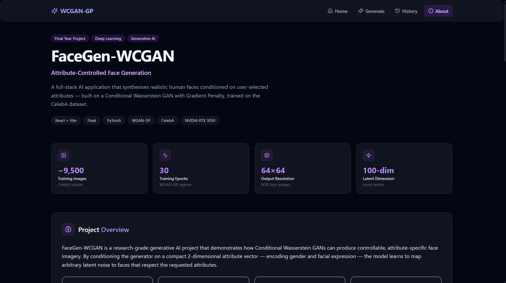
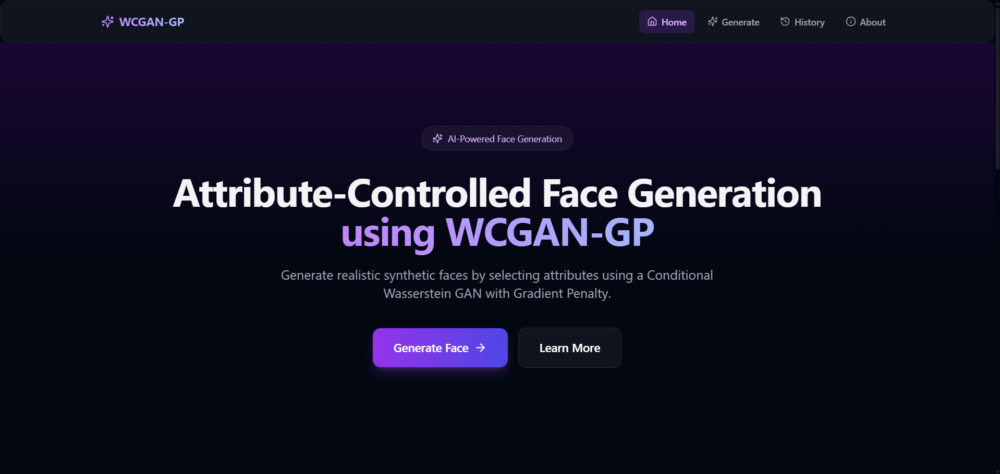
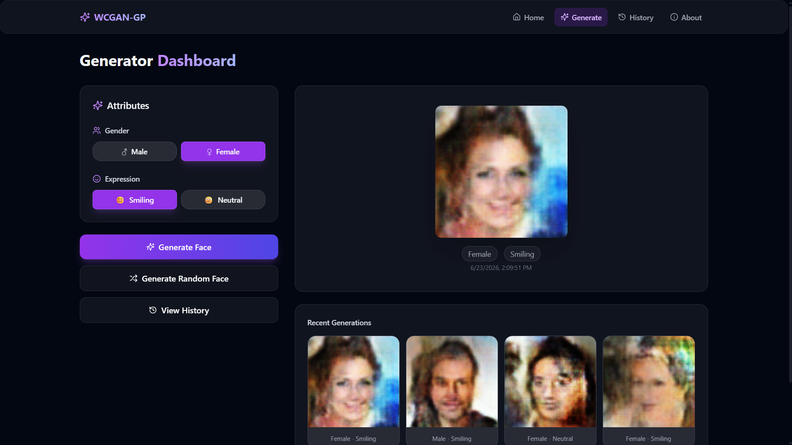
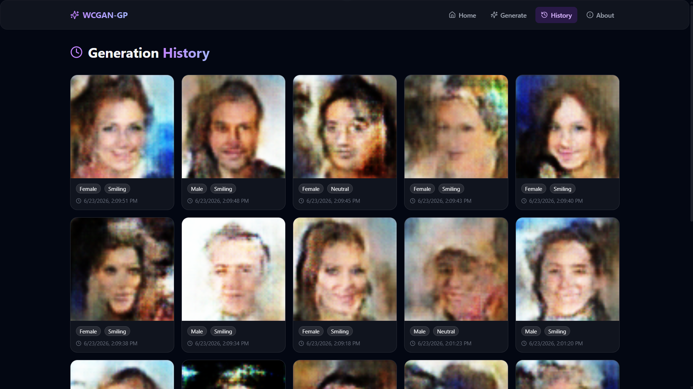

# WCGAN Web Interface

A full-stack web application for conditional face generation using a Wasserstein Conditional Generative Adversarial Network (WCGAN-GP). The project combines a PyTorch-based deep learning backend with a modern React frontend, enabling users to generate synthetic human faces based on selected attributes through an intuitive web interface.

## Live Demo

Frontend: https://wcgan-web-interface-g33yu1trz-stasshhy.vercel.app

Backend API: https://wcgan-web-interface.onrender.com/api/health

## Screenshots

### Landing Page



### Face Generation Dashboard



### Generated Face Example



### Generation History



## Overview

WCGAN Web Interface provides an interactive platform for generating facial images conditioned on attributes such as:

* Gender (Male / Female)
* Expression (Smiling / Neutral)

The model was trained on approximately 9,500 CelebA images and deployed as a complete end-to-end web application.

## Features

* Conditional face generation using WCGAN-GP
* Gender and expression control
* Flask REST API backend
* React + Vite frontend
* Generation history tracking
* Image download functionality
* Responsive modern UI
* Live deployment using Vercel and Render

## Technology Stack

### Frontend

* React.js
* Vite
* Tailwind CSS
* Axios

### Backend

* Flask
* Python
* PyTorch
* Flask-CORS

### Machine Learning

* WCGAN-GP (Wasserstein GAN with Gradient Penalty)
* Conditional Image Generation
* Deep Convolutional Neural Networks

## Deployment Architecture

Frontend (Vercel)
↓
REST API Requests
↓
Flask Backend (Render)
↓
PyTorch WCGAN-GP Model
↓
Generated Face Images

## Project Structure

```text
WCGAN-Web-Interface/
│
├── backend/
│   ├── app.py
│   ├── inference.py
│   ├── model.py
│   ├── train.py
│   ├── utils.py
│   ├── checkpoints/
│   └── req.txt
│
├── frontend/
│   ├── src/
│   ├── public/
│   ├── package.json
│   └── vite.config.js
│
└── .gitignore
```

## Installation

### Clone Repository

```bash
git clone https://github.com/AnkitBind21/WCGAN-Web-Interface.git
cd WCGAN-Web-Interface
```

### Backend Setup

```bash
cd backend
python -m venv venv

# Windows
venv\Scripts\activate

pip install -r req.txt
```

### Frontend Setup

```bash
cd frontend
npm install
```

## Running the Application

### Start Backend

```bash
cd backend
python app.py
```

### Start Frontend

```bash
cd frontend
npm run dev
```

## Training Details

* Dataset: CelebA
* Images Used: ~9,500
* Architecture: WCGAN-GP
* Framework: PyTorch
* Training Device: NVIDIA RTX 3050 Laptop GPU (4GB VRAM)

## Future Improvements

* Additional facial attributes
* Higher-resolution generation
* Better identity consistency
* Multiple pretrained models
* Cloud GPU inference

## Author

Ankit Bind

B.Sc. Information Technology

Machine Learning | Deep Learning | Computer Vision | Artificial Intelligence
